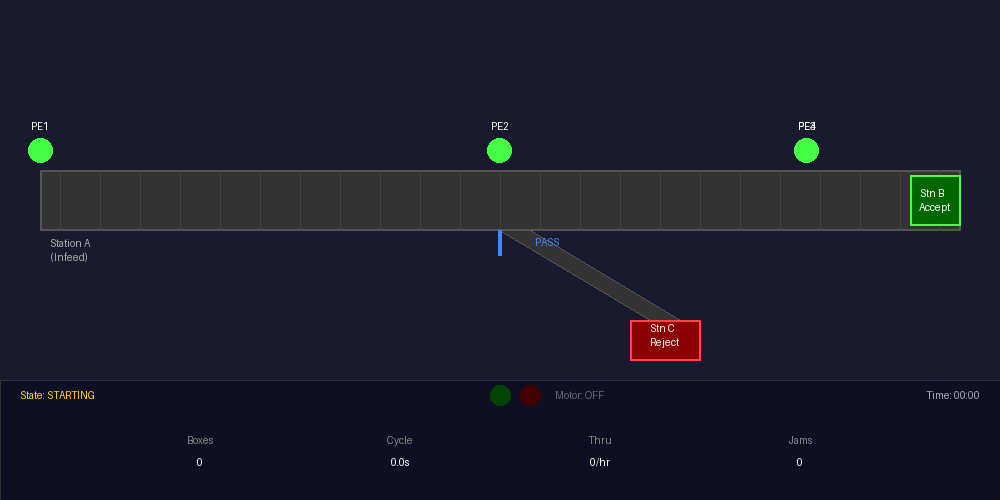
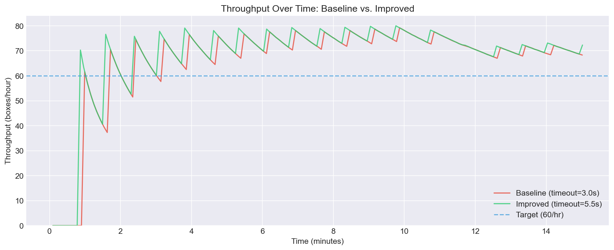
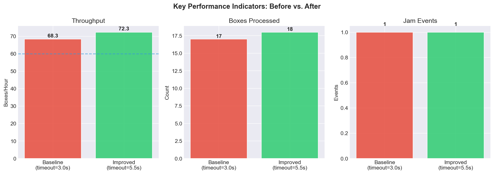
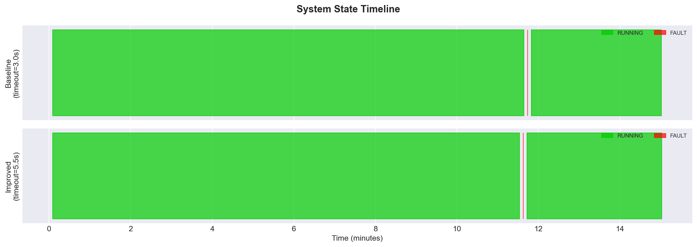
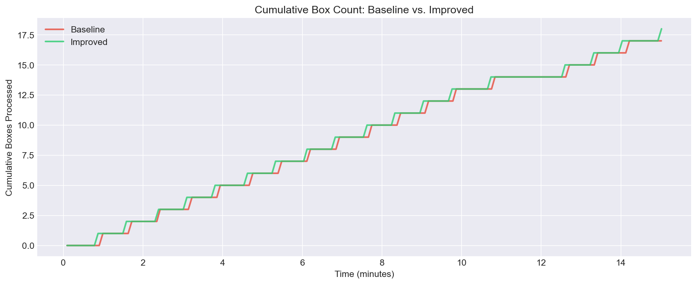

# Mini-Fulfillment Conveyor Automation

**A PLC-controlled conveyor system that scans, routes, and tracks packages -- built from scratch to demonstrate industrial automation, safety engineering, and data-driven continuous improvement.**

> Boxes arrive. Photoeyes detect them. The PLC decides: accept or reject.
> The diverter gate fires. Metrics tick upward. And when a jam strikes,
> the system halts, alarms, and waits for the operator -- exactly as
> a real fulfillment center conveyor would.

<p align="center">
  
  <br/>
  <em>Live simulator: boxes enter at Station A, get routed to accept/reject, and the PLC handles jam faults automatically</em>
</p>

---

## What This Project Does

This is a **complete automation system** for a simplified fulfillment center conveyor line:

```
                   CONVEYOR DIRECTION --->

  [Box Source]     [Infeed PE]        [Diverter PE]        [Outfeed B PE]
       |               |                   |                     |
       v               v                   v                     v
   +---------+   +===========+   +===============+-----> [Station B: ACCEPT]
   |  FEED   |-->|  CONVEYOR |-->|   DIVERTER    |
   +---------+   +===========+   +===============+-----> [Station C: REJECT]
                                                               ^
                                                         [Outfeed C PE]
```

- **PLC logic** (IEC 61131-3 Structured Text) runs a state machine with safety interlocks, jam detection on 4 photoeyes, and pattern-based accept/reject routing
- **Python process simulator** models box physics, photoeye triggering, and jam injection -- talks to the PLC via OPC-UA, or runs fully standalone
- **Real-time visualizer** (Tkinter) shows boxes moving on the conveyor with live status indicators
- **Data logging** captures every box arrival, exit, and jam event to CSV for analysis
- **Continuous improvement experiment** compares tuned vs. baseline parameters using the logged data

---

## Simulation Results

Both runs: 15-minute duration, 72 boxes/hour arrival rate, 10% jam probability, same random seed.

**Baseline** -- jam timeout = 3.0s (aggressive) | **Improved** -- jam timeout = 5.5s (tuned)

| Metric | Baseline | Improved | Change |
|---|---|---|---|
| Boxes processed | 17 | 18 | +1 |
| Throughput | 68.3 /hr | 72.3 /hr | **+5.9%** |
| Avg cycle time | 8.28s | 8.08s | -0.20s |
| Jam events | 1 | 1 | -- |
| Accept (Station B) | 12 | 13 | +1 |
| Reject (Station C) | 5 | 5 | -- |

### Throughput Over Time



### Key Performance Indicators



### System State Timeline



### Cumulative Box Count



---

## How It Works

### The PLC (7 Function Blocks in Structured Text)

```
PRG_Main (state machine)
  |
  +-- FB_Safety ........... E-Stop latching, start/stop qualification
  +-- FB_JamDetection ..... TON timers on 4 photoeyes, configurable timeout
  +-- FB_Conveyor ......... Motor control, auto/manual modes
  +-- FB_Diverter ......... Accept/reject routing (every 3rd box rejected)
  +-- FB_ManualMode ....... Jog-while-held with safety override
  +-- FB_Metrics .......... Box count, cycle time, throughput, uptime
```

**State machine:** `STOPPED` -> `STARTING` (1s pre-check) -> `RUNNING` -> `FAULT`

**Safety design:** The motor output is gated by **four independent conditions in series** -- even if the state machine has a bug, the motor physically cannot run if E-Stop is active, a fault is latched, or the stop button is pressed:

```
Motor ON = RunCommand AND EStop_Healthy AND NOT EStop_Latched AND Stop_NotPressed
```

### The Simulator

The Python simulator replaces physical hardware:

1. **Generates boxes** at a configurable arrival rate with random jitter
2. **Moves them** along a modeled conveyor belt (position-based physics with sub-stepping)
3. **Triggers photoeyes** as boxes pass sensor positions (range-based overlap detection)
4. **Injects jams** randomly (box gets stuck, blocks a PE, PLC detects the timeout)
5. **Reads PLC outputs** to determine if the motor is on and which way the diverter is pointing
6. **Logs everything** to CSV for post-run analysis

When CODESYS isn't available, the simulator runs a **local PLC logic engine** (`local_plc_logic.py`) that faithfully mirrors all the Structured Text function blocks in Python.

---

## Run It Yourself

**No special hardware or software licenses needed.** The simulator runs fully standalone.

### Quick Start

```bash
cd simulation
pip install pyyaml matplotlib pandas

# Run a 15-minute simulation at 100x speed
python process_sim.py --no-viz --duration 900 --time-scale 100 --output-dir ../data/baseline

# Run the improved configuration
python process_sim.py --no-viz --duration 900 --time-scale 100 --jam-timeout 5.5 --output-dir ../data/improved

# Generate comparison plots
python generate_plots.py
```

### With Live Visualization (requires display)

```bash
python process_sim.py --duration 120 --time-scale 5
```

This opens a Tkinter window showing the conveyor in real time -- the GIF at the top of this README was captured from this view. Boxes enter at the left, get scanned at each photoeye, and exit to Station B (accept) or C (reject) on the right. When a jam strikes, the system goes to FAULT (red), clears the jam, and resumes automatically.

### Full Experience (with CODESYS)

1. Install [CODESYS V3.5](https://store.codesys.com/) (free)
2. Import the `.st` files following [`plc/README.md`](plc/README.md)
3. Run the soft PLC + Python simulator connected via OPC-UA

---

## Project Structure

```
automation_amz/
├── plc/                        # IEC 61131-3 Structured Text
│   ├── types.st                    State/fault enums, metrics struct
│   ├── io_mapping.st               8 DI + 5 DO address mapping
│   ├── global_vars.st              Shared variables + HMI tags
│   ├── fb_safety.st                E-Stop latching, interlocks
│   ├── fb_conveyor.st              Motor control (auto + jog)
│   ├── fb_jam_detection.st         4x photoeye jam timers
│   ├── fb_diverter.st              Accept/reject routing
│   ├── fb_manual_mode.st           Manual jog control
│   ├── fb_metrics.st               Counters, cycle time, throughput
│   └── prg_main.st                 State machine orchestrator
├── simulation/                 # Python process simulator
│   ├── process_sim.py              Main simulator + CLI
│   ├── local_plc_logic.py          Standalone PLC logic engine
│   ├── opc_client.py               OPC-UA interface (+ local fallback)
│   ├── data_logger.py              CSV metric/event logging
│   ├── visualizer.py               Real-time Tkinter display
│   └── generate_plots.py           Analysis plot generation
├── docs/                       # Documentation
│   ├── 01_requirements.md          Scope, I/O, success criteria
│   ├── 02_io_table.md              Full I/O address table
│   ├── 03_block_diagram.md         P&ID with Mermaid diagrams
│   ├── 04_state_diagram.md         State machine + truth tables
│   ├── 05_testing_protocol.md      14 scripted test scenarios
│   ├── 06_operator_manual.md       One-page operator guide
│   └── 07_technical_report.md      Architecture + CI experiment report
├── hmi/                        # HMI screen designs + tag bindings
├── data/                       # Simulation run data + Jupyter analysis
└── tests/                      # Test scenarios + results
```

---

## Key Design Decisions

**E-Stop as latching fault** -- Once triggered, the system requires the operator to both release the E-Stop AND explicitly press Fault Clear before restarting. This prevents accidental restarts, matching industrial best practice.

**Configurable jam timeout** -- The HMI exposes the jam detection threshold (default 4.0s). Operators can tune it for their conditions. The CI experiment demonstrates how this single parameter affects throughput and false-positive rates.

**Every 3rd box rejected** -- Deterministic routing pattern for reproducible testing. In production, this would be driven by barcode/RFID scan results.

**Sub-stepped physics** -- The simulator caps physics updates at 0.05s of simulated time regardless of time scale, preventing boxes from teleporting past photoeyes at high simulation speeds.

---

## Built With

| Layer | Technology |
|---|---|
| PLC Logic | IEC 61131-3 Structured Text (CODESYS V3.5) |
| PLC Runtime | CODESYS Control Win V3 (soft PLC) or Python local engine |
| Communication | OPC-UA (built into CODESYS) |
| Simulator | Python 3.9+ (pyyaml, matplotlib, pandas) |
| Visualization | Tkinter |
| Analysis | Jupyter Notebook / matplotlib |

---

*This project is for educational and portfolio purposes. The safety logic is simulated and is not SIL-rated.*
