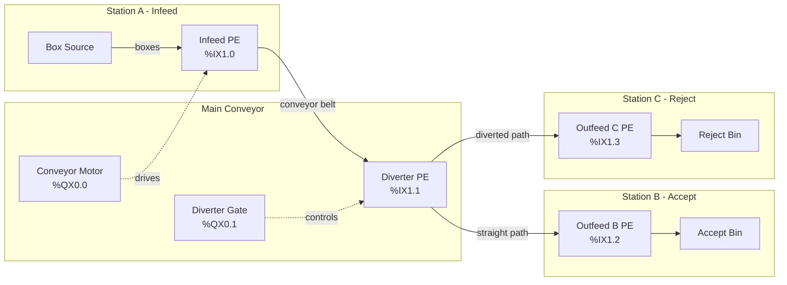
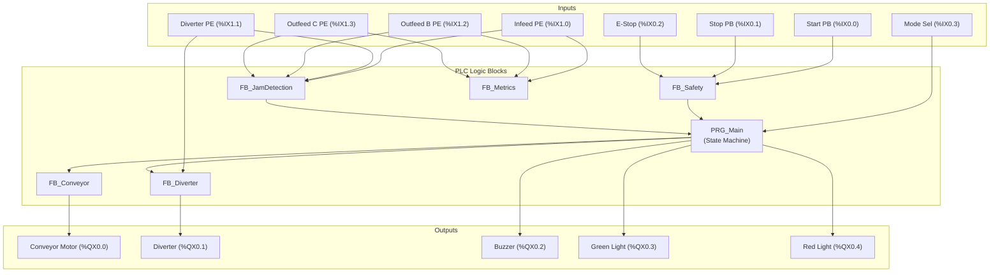

# Process Block Diagram (P&ID)

## System Layout



## Physical Layout (Top View)

```
                        CONVEYOR DIRECTION --->

    +============================================================+
    |                                                            |
    |  [Box Source]    [Infeed PE]         [Diverter PE]         |
    |       |              |                    |                |
    |       v              v                    v                |
    |   +------+      +--------+          +----------+          |
    |   | FEED |----->| ====== |--------->| ======== |----+     |
    |   +------+      +--------+          +----------+    |     |
    |                                          |          |     |
    |                                   [Diverter Gate]   |     |
    |                                          |          |     |
    |                                          v          v     |
    |                                    +---------+ +--------+ |
    |                                    |Outfeed C| |Outfeed B| |
    |                                    |   PE    | |   PE    | |
    |                                    +---------+ +--------+ |
    |                                          |          |     |
    |                                          v          v     |
    |                                    +---------+ +--------+ |
    |                                    | REJECT  | | ACCEPT | |
    |                                    |  BIN    | |  BIN   | |
    |                                    +---------+ +--------+ |
    |                                                            |
    +============================================================+

    OPERATOR PANEL:
    [START PB]  [STOP PB]  [E-STOP]  [MODE SEL]
      %IX0.0     %IX0.1     %IX0.2     %IX0.3

    STATUS INDICATORS:
    [GREEN LIGHT]  [RED LIGHT]  [BUZZER]
      %QX0.3        %QX0.4      %QX0.2
```

## Signal Flow Diagram



## Sensor Placement Details

| Sensor | Position | Purpose | Detection Range |
|---|---|---|---|
| Infeed PE | 150 mm from conveyor start | Detect box arrival, start cycle timer | 0-300 mm |
| Diverter PE | At diverter gate, center | Detect box at routing decision point | 0-300 mm |
| Outfeed B PE | 150 mm before Station B end | Confirm box reached accept bin | 0-300 mm |
| Outfeed C PE | 150 mm before Station C end | Confirm box reached reject bin | 0-300 mm |

## Conveyor Dimensions (Simulated)

| Parameter | Value |
|---|---|
| Total conveyor length | 3000 mm |
| Infeed to diverter | 1500 mm |
| Diverter to Outfeed B | 1000 mm |
| Diverter to Outfeed C | 1000 mm |
| Conveyor width | 400 mm |
| Belt speed (nominal) | 0.5 m/s |
| Box size | 200 x 200 x 150 mm |
