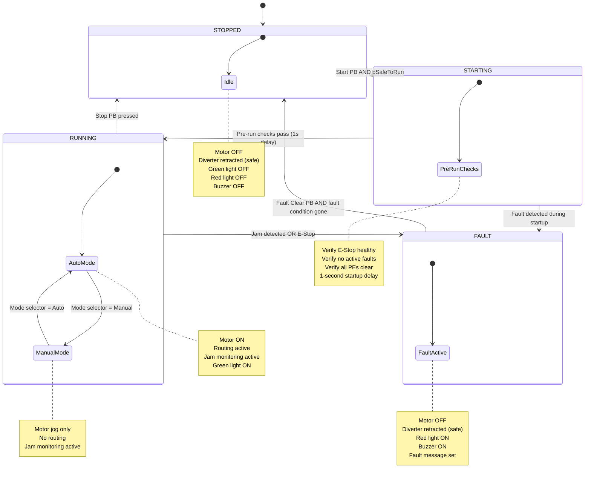

# Control Logic Design

State machine, truth tables, and logic rules for the mini-fulfillment conveyor system.

## 1. System State Machine



## 2. State Transition Table

| Current State | Event / Condition | Next State | Actions |
|---|---|---|---|
| STOPPED | Start PB rising edge AND bSafeToRun | STARTING | Begin pre-run checks, start 1s timer |
| STOPPED | E-Stop pressed | STOPPED | Latch E-Stop fault (stays stopped) |
| STARTING | 1s timer elapsed AND all checks OK | RUNNING | Energize motor, enable routing, green light ON |
| STARTING | Fault detected (E-Stop, PE blocked) | FAULT | Set fault message, red light ON, buzzer ON |
| RUNNING | Stop PB pressed (falling edge on NC) | STOPPED | De-energize motor, retract diverter |
| RUNNING | E-Stop pressed | FAULT | Immediate motor OFF, latch E-Stop fault, red light, buzzer |
| RUNNING | Jam detected | FAULT | Motor OFF, set jam fault message, red light, buzzer |
| FAULT | Fault Clear PB AND fault condition cleared | STOPPED | Reset fault latch, buzzer OFF, red light OFF |
| ANY | E-Stop pressed | FAULT | Immediate motor OFF (overrides all states) |

## 3. Safety Interlock Truth Table

The conveyor motor can only run when ALL of the following conditions are TRUE:

| Condition | Symbol | Required Value | Description |
|---|---|---|---|
| E-Stop healthy | `bEStop` | TRUE (NC closed) | Emergency stop circuit intact |
| No active fault | `NOT bFaultActive` | TRUE | No uncleared fault condition |
| System in RUNNING | `eState = RUNNING` | TRUE | State machine is in RUNNING |
| Stop PB not pressed | `bStopPB` | TRUE (NC closed) | Stop button not pressed |

**Motor output equation:**

```
bConveyorMotor := bEStop AND (NOT bFaultActive) AND (eState = RUNNING) AND bStopPB;
```

## 4. Jam Detection Logic

### Jam Timer Truth Table

| Photoeye | Blocked Duration | Jam Timeout | Result |
|---|---|---|---|
| Any PE | < tJamTimeout | 4.0 s (default) | No fault |
| Any PE | >= tJamTimeout | 4.0 s (default) | JAM FAULT: identify location |
| Any PE | < tJamTimeout | (HMI adjusted) | No fault |

### Jam Detection Per Photoeye

```
FOR each photoeye (Infeed, Diverter, Outfeed B, Outfeed C):
    IF photoeye is blocked THEN
        Start/continue TON timer for that PE
    ELSE
        Reset TON timer for that PE
    END_IF

    IF TON timer elapsed >= tJamTimeout THEN
        SET bJamDetected := TRUE
        SET sJamLocation := name of this PE
        SET bFaultActive := TRUE
    END_IF
END_FOR
```

### Jam Fault Clear Conditions

Both conditions must be TRUE simultaneously:

| Condition | Description |
|---|---|
| Fault Clear PB pressed | Operator acknowledges the fault |
| Jammed PE is clear | The photoeye that triggered the jam is no longer blocked |

## 5. Diverter / Routing Logic

### Accept/Reject Decision

For deterministic testing, every 3rd box is rejected:

```
boxCounter := boxCounter + 1;    (* increment on infeed PE rising edge *)

IF (boxCounter MOD 3) = 0 THEN
    bRejectNext := TRUE;         (* next box goes to Station C *)
ELSE
    bRejectNext := FALSE;        (* next box goes to Station B *)
END_IF
```

### Diverter Actuation Truth Table

| Box at Diverter PE | bRejectNext | Diverter Output | Box Destination |
|---|---|---|---|
| FALSE | X | FALSE (retracted) | N/A - no box present |
| TRUE | FALSE | FALSE (retracted) | Station B (accept) |
| TRUE | TRUE | TRUE (extended) | Station C (reject) |
| (box clears) | X | FALSE (retracted) | Return to safe position |

### Diverter Timing

```
ON diverterPE rising edge:
    IF bRejectNext THEN
        Energize diverter actuator
    END_IF

ON diverterPE falling edge:
    De-energize diverter actuator (return to safe position)
    Clear bRejectNext flag
```

## 6. Manual / Jog Mode Logic

### Mode Selection Truth Table

| Mode Selector | System State | Jog PB | Motor Behavior |
|---|---|---|---|
| Auto (0) | RUNNING | N/A | Motor ON continuously |
| Auto (0) | Not RUNNING | N/A | Motor OFF |
| Manual (1) | RUNNING | Pressed | Motor ON (jog) |
| Manual (1) | RUNNING | Released | Motor OFF |
| Manual (1) | FAULT | Any | Motor OFF (safety override) |

### Manual Mode Rules

1. Jog is only allowed when state = RUNNING and mode = Manual.
2. All safety interlocks remain active in Manual mode.
3. Diverter does not actuate automatically in Manual mode.
4. Jam detection remains active in Manual mode.

## 7. Output Summary by State

| Output | STOPPED | STARTING | RUNNING (Auto) | RUNNING (Manual) | FAULT |
|---|---|---|---|---|---|
| Conveyor Motor | OFF | OFF | ON | Jog only | OFF |
| Diverter | Retracted | Retracted | Per routing logic | Retracted | Retracted |
| Alarm Buzzer | OFF | OFF | OFF | OFF | ON |
| Green Light | OFF | Blinking | ON | ON | OFF |
| Red Light | OFF | OFF | OFF | OFF | ON (blinking) |

## 8. Fault Code Table

| Fault Code | Name | Trigger | Clear Condition |
|---|---|---|---|
| 1 | E-Stop Activated | `bEStop = FALSE` | E-Stop reset AND Fault Clear PB |
| 2 | Jam at Infeed | Infeed PE blocked > timeout | PE clear AND Fault Clear PB |
| 3 | Jam at Diverter | Diverter PE blocked > timeout | PE clear AND Fault Clear PB |
| 4 | Jam at Outfeed B | Outfeed B PE blocked > timeout | PE clear AND Fault Clear PB |
| 5 | Jam at Outfeed C | Outfeed C PE blocked > timeout | PE clear AND Fault Clear PB |
